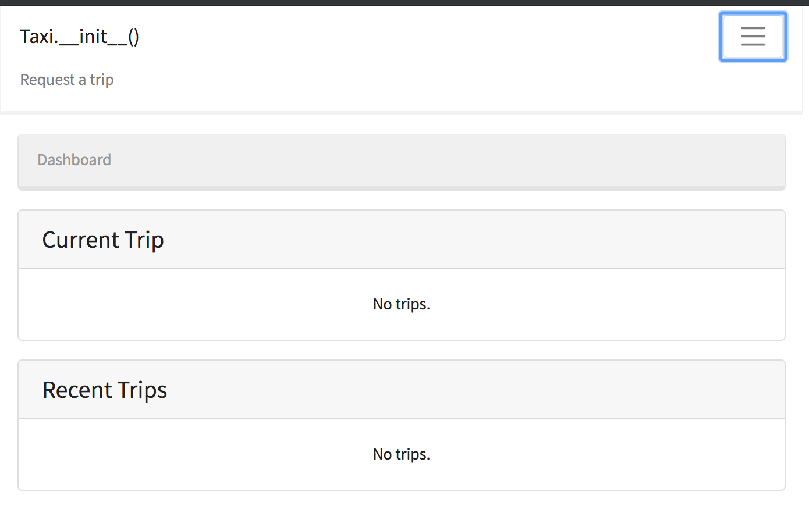
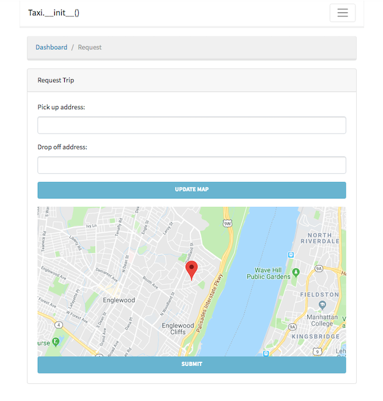

# `Taxi.__init__()` #

Overview:

A ride-sharing application incorporating an Angular front-end with a Django back-end configured inside a single Docker container, focusing on real-time communication between the client-side and server-side logic.

# Server #

## Languages, Technologies & Frameworks: ##

1. Python
2. Django
3. Django REST Framework
4. Django Channels
5. Redis

- Developed a custom user authentication model
- Created data models and APIs to track trips riders and drivers participate in
- Leveraged async Django Channels to send and receive messages via WebSockets
- Utilized test-driven development to ensure each function operates as expected

# Client #

## Languages, Technologies & Frameworks ##

1. AngularJS
2. TypeScript
3. Jasmine
4. Karma
5. Geolocation
6. Google Maps

- Wrote components and services to complement server-side user authentication with Angular and TypeScript
- Created a full test suite for each service and component using Jasmin and the Angular testing framework
- Built rider and driver dashboard components, connecting each channel through established WebSockets connections with the server
- Incorporated Google Maps so that users can visualize their current locations and subscribed trip information

# Screenshots

A (currently) empty view of the dashboard component

Request a ride and view your location and trip with Google Maps:

